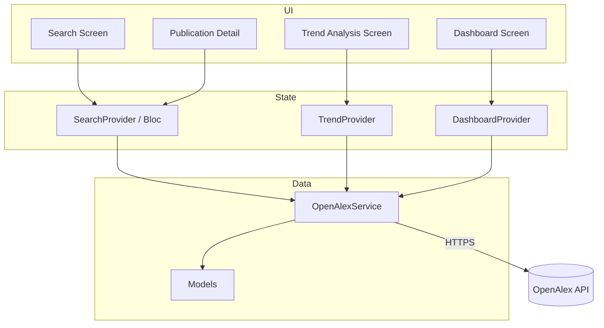

# PRM393 Lab2 – Phân tích đề bài: Journal Trend Analyzer

> **Môn học:** Mobile Programming (PRM393)  
> **Đề tài:** Journal Trend Analysis Mobile Application  
> **Nguồn dữ liệu:** [OpenAlex API](https://developers.openalex.org/api-reference/introduction)  
> **Công nghệ:** Flutter + Dart

---

## 1. Tổng quan bài tập

Bài lab yêu cầu xây dựng ứng dụng di động **Journal Trend Analyzer** — công cụ phân tích xu hướng nghiên cứu học thuật. Người dùng nhập một chủ đề (topic), ứng dụng gọi trực tiếp OpenAlex API từ client Flutter, xử lý JSON và hiển thị kết quả qua giao diện + biểu đồ + dashboard.

**Mục tiêu cốt lõi:** Không dùng backend riêng, không hard-code dữ liệu — mọi số liệu phải lấy động từ OpenAlex.

---

## 2. Mục tiêu học tập (Learning Objectives)

| STT | Mục tiêu | Liên hệ triển khai |
|-----|----------|-------------------|
| 1 | Flutter cross-platform | Một codebase chạy Android (bắt buộc) |
| 2 | RESTful API integration | `http`/`dio` gọi `https://api.openalex.org` |
| 3 | Xử lý JSON | Model classes + `fromJson`/`toJson` |
| 4 | Async + state management | `Future`, Provider/Riverpod/Bloc… |
| 5 | UI/UX mobile | Navigation, loading, error states |
| 6 | Data visualization | `fl_chart`, `syncfusion_flutter_charts`, v.v. |
| 7 | AI-assisted code review | SonarQube, CodeRabbit, Copilot Review… |
| 8 | Kiến trúc maintainable | Tách models / services / screens / widgets |

---

## 3. Phạm vi (Scope) và ngoài phạm vi (Out of Scope)

### 3.1 Trong phạm vi

- Tìm kiếm publication theo topic
- Chi tiết từng bài báo
- Phân tích xu hướng theo năm
- Top papers, journals, authors
- Dashboard tổng hợp
- Gọi OpenAlex trực tiếp từ app mobile

### 3.2 Ngoài phạm vi (không làm)

| Loại | Ví dụ |
|------|-------|
| Backend tự viết | REST API server riêng |
| Auth | Login, đăng ký, phân quyền |
| Database / cloud persistence | SQLite local (nếu không yêu cầu) cũng không bắt buộc |
| Real-time sync | WebSocket, push notification |
| Thanh toán, mạng xã hội | Comment, like, share |
| ML training | Huấn luyện model |
| Web app | Chỉ mobile Flutter |

> **Lưu ý:** Cache local tạm thời (memory) để tránh gọi API lặp lại trong cùng phiên là hợp lý, miễn là dữ liệu gốc vẫn từ OpenAlex.

---

## 4. Yêu cầu chức năng chi tiết

### 4.1 Topic Search (Màn hình tìm kiếm)

**Input:** Từ khóa topic (AI, Software Engineering, IoT, … hoặc tùy ý).

**Output danh sách:** Mỗi publication hiển thị tối thiểu:

- Title (tiêu đề)
- Publication year (năm xuất bản)
- Citation count (số trích dẫn)
- Journal name (tên tạp chí)

**Gợi ý OpenAlex:**

```http
GET https://api.openalex.org/works?search={topic}&per_page=25&api_key={KEY}
```

Có thể bổ sung `filter`, `sort=cited_by_count:desc` tùy UX.

**Trường JSON hữu ích:**

- `title`
- `publication_year`
- `cited_by_count`
- `primary_location.source.display_name` (tên journal/source)

---

### 4.2 Publication Details (Màn hình chi tiết)

**Hiển thị khi user chọn một publication:**

| Trường | Nguồn OpenAlex (gợi ý) |
|--------|------------------------|
| Title | `title` |
| Authors | `authorships[].author.display_name` |
| Year | `publication_year` |
| Journal | `primary_location.source.display_name` |
| Citations | `cited_by_count` |
| DOI | `doi` hoặc `ids.doi` |
| Abstract | `abstract_inverted_index` (cần ghép lại) hoặc trường abstract nếu có |

```http
GET https://api.openalex.org/works/{work_id}?api_key={KEY}
```

**Lưu ý:** Abstract trong OpenAlex thường ở dạng `abstract_inverted_index` — cần hàm decode trước khi hiển thị.

---

### 4.3 Publication Trend Analysis (Phân tích xu hướng theo năm)

**Yêu cầu:** Nhóm publication theo `publication_year`, vẽ biểu đồ thể hiện tăng/giảm theo thời gian.

**Cách triển khai:**

1. Lấy batch works theo topic (phân trang `page` hoặc `cursor`).
2. Aggregate client-side: `Map<int year, int count>`.
3. Vẽ line chart / bar chart theo năm.

**Gợi ý API (aggregate phía server — tùy chọn):**

```http
GET https://api.openalex.org/works?search={topic}&group_by=publication_year&api_key={KEY}
```

Dùng `group_by` giảm tải client và đúng tinh thần analytics.

---

### 4.4 Top Influential Papers (Bài báo ảnh hưởng)

**Tiêu chí:** Xếp hạng theo `cited_by_count` giảm dần.

```http
GET https://api.openalex.org/works?search={topic}&sort=cited_by_count:desc&per_page=10
```

Có thể tái sử dụng kết quả search đã sort thay vì gọi endpoint riêng.

---

### 4.5 Top Research Journals (Tạp chí đóng góp nhiều nhất)

**Tiêu chí:** Journal có nhiều publication nhất liên quan topic.

**Cách 1 — Client-side:** Đếm frequency của `primary_location.source.display_name` từ tập works.

**Cách 2 — Server-side:**

```http
GET https://api.openalex.org/works?search={topic}&group_by=primary_location.source.id&per_page=10
```

Hiển thị: ranked list hoặc bar chart.

---

### 4.6 Top Contributing Authors (Tác giả đóng góp nhiều nhất)

**Tiêu chí:** Author có nhiều paper nhất trong tập kết quả topic.

**Cách triển khai:**

- Duyệt `authorships` của mỗi work, đếm theo `author.id` hoặc `display_name`.
- Hoặc dùng `group_by=authorships.author.id` nếu API hỗ trợ filter/search kết hợp.

**Output:** Tên author + số lượng publication.

---

### 4.7 Research Trend Dashboard (Bảng tổng hợp)

Dashboard tổng hợp **một topic đã chọn**, gồm:

| Chỉ số | Cách tính gợi ý |
|--------|-----------------|
| Total publications | `meta.count` từ search hoặc số work đã fetch |
| Average citation count | Trung bình `cited_by_count` |
| Most active publication year | Năm có count lớn nhất (từ trend) |
| Top journal | Journal frequency cao nhất |
| Top author | Author count cao nhất |
| Most influential paper | Work có `cited_by_count` max |

Có thể tính từ một lần fetch + aggregate thay vì 6 API call riêng.

---

## 5. Yêu cầu kỹ thuật

### 5.1 Stack bắt buộc

- **Flutter + Dart**
- Chạy được trên **Android device / emulator**

### 5.2 Kỹ năng cần thể hiện trong code

- API integration (async)
- JSON parsing
- Error handling (network, 4xx/5xx, empty results)
- Loading states (CircularProgressIndicator, skeleton…)
- Data visualization (charts)

### 5.3 Cấu trúc thư mục tối thiểu

```
lib/
├── main.dart
├── models/           # Work, Author, Journal, TrendData, DashboardSummary...
├── services/         # OpenAlexService, ApiClient
├── screens/          # Search, Detail, Trend, Dashboard
├── widgets/          # PublicationCard, TrendChart, StatTile...
└── providers/        # hoặc bloc/, controllers/ — state management
```

**Separation of concerns:**

- **UI (screens/widgets):** Chỉ render + user events
- **Business logic (providers/bloc):** Aggregate, sort, tính dashboard
- **Data (services/models):** HTTP + parse JSON

---

## 6. Ánh xạ màn hình (UI Requirements)

Đề bài yêu cầu **ít nhất 4 màn hình chính:**

| Màn hình | Chức năng liên kết | FR |
|----------|-------------------|-----|
| **Search Screen** | Nhập topic, danh sách kết quả | 4.1 |
| **Publication Detail Screen** | Chi tiết một paper | 4.2 |
| **Trend Analysis Screen** | Biểu đồ theo năm | 4.3 |
| **Research Dashboard Screen** | Tổng hợp KPI + top lists | 4.4–4.7 |

**Navigation gợi ý:**

```
Search ──tap item──► Detail
   │
   ├──► Trend Analysis (sau khi search / từ bottom nav)
   └──► Dashboard
```

Có thể thêm BottomNavigationBar hoặc TabBar sau khi user đã search topic.

**UX bắt buộc ngầm định:**

- Responsive layout
- Nhất quán theme (Material 3)
- Empty state khi không có kết quả
- Error message khi mất mạng

---

## 7. Tích hợp OpenAlex API

### 7.1 Thông tin cơ bản

| Thông tin | Giá trị |
|-----------|---------|
| Base URL | `https://api.openalex.org` |
| Entity chính | `/works` |
| Auth | Query param `api_key=YOUR_KEY` ([lấy key miễn phí](https://openalex.org/settings/api)) |
| Pagination | `page`, `per_page` (max 100), hoặc `cursor` cho deep pagination |
| Response | `{ meta, results, group_by }` |

### 7.2 Tham số query thường dùng

| Parameter | Mục đích |
|-----------|----------|
| `search` | Full-text theo topic |
| `filter` | Lọc theo năm, OA, citations… |
| `sort` | `cited_by_count:desc`, `publication_date:desc` |
| `group_by` | Aggregate (năm, source, author…) |
| `select` | Giảm payload — chỉ lấy field cần thiết |

### 7.3 Ví dụ request thực tế

```bash
# Tìm bài AI năm 2024, citation > 100
curl "https://api.openalex.org/works?search=artificial+intelligence&filter=publication_year:2024,cited_by_count:>100&sort=cited_by_count:desc&per_page=10&api_key=YOUR_KEY"

# Nhóm theo năm xuất bản
curl "https://api.openalex.org/works?search=blockchain&group_by=publication_year&api_key=YOUR_KEY"
```

### 7.4 Lưu ý khi implement

1. **Rate limit:** Tuân thủ [Authentication & Pricing](https://developers.openalex.org/guides/authentication) — debounce search, cache kết quả topic.
2. **Abstract:** Decode `abstract_inverted_index` nếu cần hiển thị abstract.
3. **Dehydrated objects:** Một số nested object chỉ có `id` — detail screen nên fetch full work by ID.
4. **Polite pool:** Thêm `mailto=` trong query để vào polite pool (khuyến nghị trong docs OpenAlex).

---

## 8. AI-Assisted Code Review (Bắt buộc báo cáo)

**Yêu cầu:**

- Dùng công cụ: SonarQube, Kodus AI, CodeRabbit, GitHub Copilot Code Review, …
- Phát hiện **≥ 3 issues** (bug, smell, security, improvement)
- Sửa khi phù hợp
- **Bằng chứng:** Screenshot + mô tả ngắn trong project report

**Ví dụ issue thường gặp trong lab Flutter:**

| Issue | Mức | Hướng xử lý |
|-------|-----|-------------|
| Không dispose TextEditingController | Warning | `dispose()` trong State |
| Gọi API trong `build()` | Bug/smell | Chuyển sang initState / provider |
| Hard-code API key trong source | Security | `flutter_dotenv` / `--dart-define` |
| Không handle null JSON fields | Bug | Nullable types + fallback UI |
| Widget quá lớn | Smell | Tách widget con |

---

## 9. Deliverables (Sản phẩm nộp)

| Hạng mục | Yêu cầu |
|----------|---------|
| **Source code** | GitHub repo tên `PRM393_Lab2_StudentID` |
| **Project report** | PDF 5–10 trang: overview, design, API, screenshots, trend results, AI review, challenges |
| **Demo video** | 5–10 phút: search, detail, trend, top journals/authors, dashboard, AI review |

### Checklist nộp bài

- [ ] App build và chạy Android
- [ ] 4 màn hình chính đủ FR
- [ ] Không hard-code dataset
- [ ] Cấu trúc thư mục models/services/screens/widgets/state
- [ ] Loading + error handling
- [ ] Biểu đồ xu hướng
- [ ] Dashboard đủ 6 chỉ số
- [ ] AI review ≥ 3 findings + screenshot
- [ ] Report PDF + video demo

---

## 10. Kiến trúc đề xuất



**Luồng dữ liệu điển hình:**

1. User nhập topic → `OpenAlexService.searchWorks(topic)`
2. Provider lưu `List<Work>` + `meta.count`
3. Trend/Dashboard provider aggregate từ cùng dataset (hoặc gọi `group_by`)
4. UI listen state → rebuild khi loading/success/error

---

## 11. Lộ trình triển khai gợi ý

| Phase | Công việc | Ưu tiên |
|-------|-----------|---------|
| 1 | Khởi tạo Flutter project, cấu trúc thư mục | Cao |
| 2 | Model `Work`, `Author`, service gọi `/works?search=` | Cao |
| 3 | Search Screen + list item (4 field bắt buộc) | Cao |
| 4 | Detail Screen + fetch by ID + abstract decode | Cao |
| 5 | Trend Screen + chart theo năm | Cao |
| 6 | Top papers / journals / authors | Trung bình |
| 7 | Dashboard tổng hợp 6 metrics | Trung bình |
| 8 | Polish UI, error/loading, theme | Trung bình |
| 9 | AI code review + sửa + screenshot | Bắt buộc nộp |
| 10 | Report PDF + video demo | Bắt buộc nộp |

---

## 12. Rủi ro & thách thức thường gặp

| Thách thức | Giải pháp |
|------------|-----------|
| Topic trả về quá nhiều kết quả | Giới hạn `per_page`, sample N trang, hoặc dùng `group_by` |
| Aggregate chậm trên client | Ưu tiên `group_by` phía API |
| Abstract khó parse | Viết util `reconstructAbstract(invertedIndex)` |
| Rate limit / timeout | Retry với backoff, hiển thị thông báo |
| Chart performance | Giới hạn số điểm trên trục (vd. 20 năm gần nhất) |
| Journal name null | Fallback `"Unknown Source"` |

---

## 13. Tiêu chí tự đánh giá (Mapping FR → Demo)

| FR | Demo video cần show | Pass? |
|----|-------------------|-------|
| 4.1 Search | Gõ "Machine Learning", thấy list 4 field | ☐ |
| 4.2 Detail | Tap 1 paper, thấy authors, DOI, abstract | ☐ |
| 4.3 Trend | Biểu đồ số paper theo năm | ☐ |
| 4.4 Top papers | List sort theo citation | ☐ |
| 4.5 Top journals | Rank/chart journal | ☐ |
| 4.6 Top authors | Tên + số paper | ☐ |
| 4.7 Dashboard | 6 KPI đầy đủ | ☐ |

---

## 14. Tài liệu tham khảo

- [OpenAlex API Overview](https://developers.openalex.org/api-reference/introduction)
- [OpenAlex — Filtering](https://developers.openalex.org/guides/filtering)
- [OpenAlex — Searching](https://developers.openalex.org/guides/searching)
- [OpenAlex — Grouping / Aggregate](https://developers.openalex.org/guides/grouping)
- [Flutter documentation](https://docs.flutter.dev/)

---

## 15. Kết luận

Lab2 là bài tập **full-stack mobile phía client**: tích hợp API công khai, xử lý dữ liệu lớn ở mức vừa phải, trực quan hóa và tổng hợp insight. Trọng tâm chấm điểm thường nằm ở:

1. **Đủ 7 nhóm chức năng (FR 4.1–4.7)** và **4 màn hình**
2. **Dữ liệu 100% từ OpenAlex**, có xử lý async/error/loading
3. **Cấu trúc code rõ ràng** (models / services / screens / state)
4. **Deliverables đ完整:** repo, report, video, AI review evidence

Repo hiện tại (`prm393-lab2`) mới có README — bước tiếp theo là `flutter create`, implement `OpenAlexService`, và xây dựng lần lượt 4 màn hình theo lộ trình ở mục 11.
